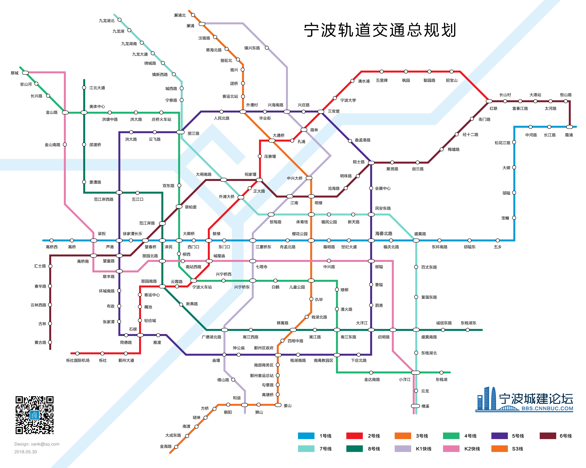

# 宁波地铁线路图

**在线浏览：**

http://subway.cnnbuc.com

**宁波城建论坛：**

http://bbs.cnnbuc.com

## 宁波地铁线路建设计划

| 线路       | 状态 | 开通年份 |
| ---------- | ---- | -------- |
| 1 号线一期 | 运营 | 2014     |
| 1 号线二期 | 运营 | 2016     |
| 2 号线一期 | 运营 | 2015     |
| 2 号线二期 | 运营 | 2019     |
| 3 号线     | 在建 | 2019     |
| S3 号线    | 在建 | 2019     |
| 4 号线     | 在建 | 2020     |
| 5 号线一期 | 在建 | 2022     |
| 5 号线二期 | 规划 | 2025     |
| 6 号线     | 规划 | 2025     |
| 7 号线     | 规划 | 2025     |
| 8 号线     | 规划 | 2025     |
| K1 号线    | 规划 | 2030     |
| K2 号线    | 规划 | 2030     |

### 地铁建设流程

1.  规划
2.  审批
3.  开建
4.  盾构贯通
5.  铺轨施工
6.  空载试运行
7.  试运营

## 相关工具

**地铁 SVG 转换器**

https://github.com/cnuc-top/subway-svg-tools

本工具用于将 SVG 地铁图转换为 JSON 数据用于本项目
